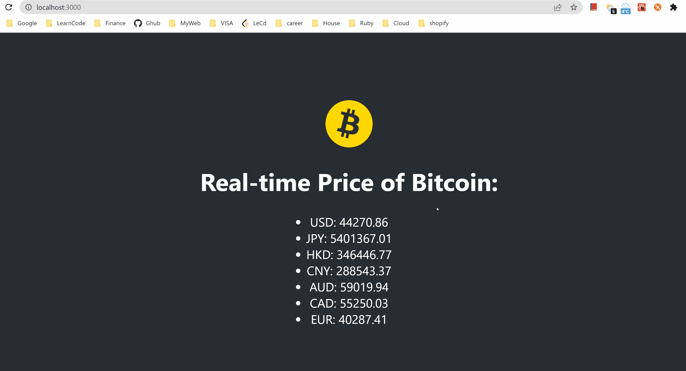

# This is project to show real-time price of Bitcoin
 
## Technologies
1. Front-end: React, Apollo.
2. Back-end: Node.js.
3. Api: GraphQL.

## Demo

 
## Available Scripts

1. In the `client` directory

  - run `npm start` to start client server.

2. In the `server` directory

  - run `node app.js` to start backend server.
 